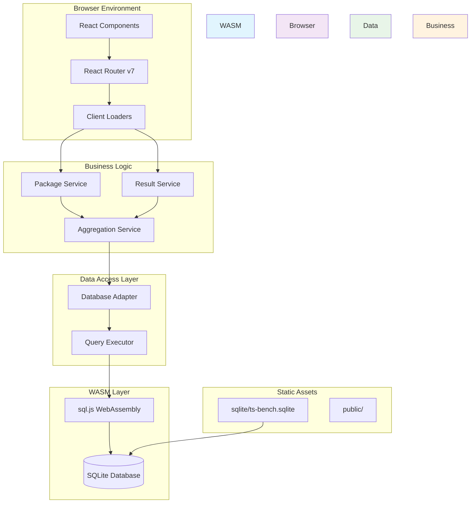
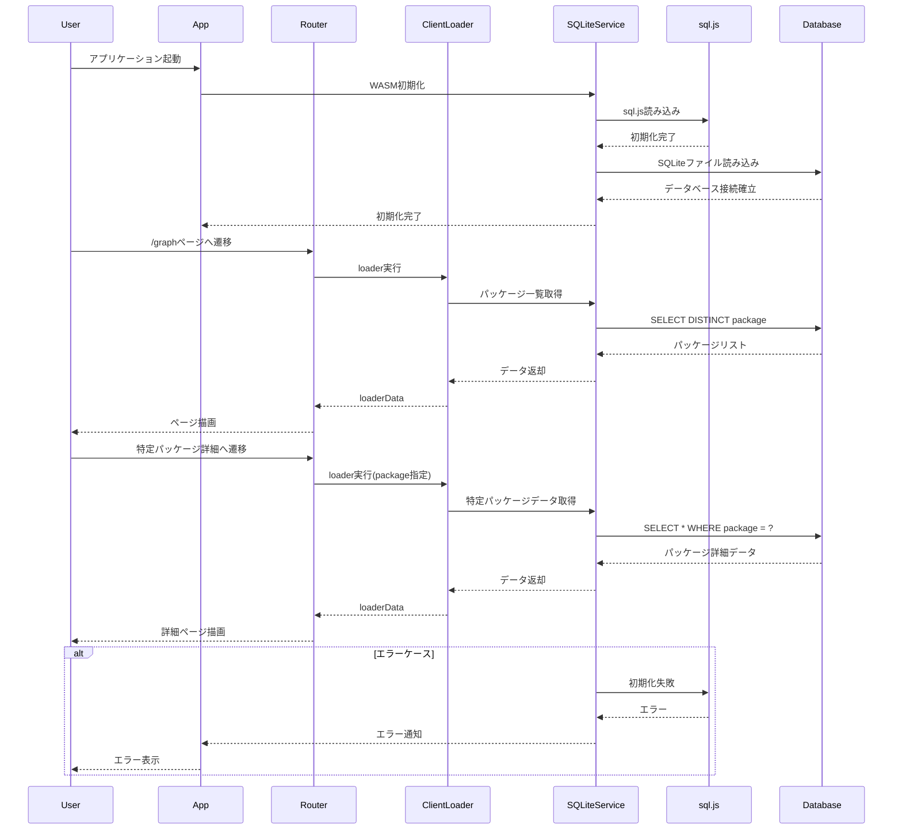

# 技術設計書: WASM+SPA構成への移行

## 設計概要

### アーキテクチャ概要
TypeScriptパフォーマンス監視ツール「ts-bench」のWebダッシュボードを、SSG（Static Site Generation）からWASM+SPA（WebAssembly + Single Page Application）構成に移行する。ブラウザでsql.jsを使用してSQLiteデータベースを直接読み込み、React Router v7のClient Loaderで必要なデータのみを動的に取得する構成に変更する。

### 技術スタック
- **フロントエンド**: React 19.1.1 + React Router v7.8.0
- **WASM**: sql.js (SQLite公式WebAssembly版)
- **チャートライブラリ**: Recharts 2.15.4 (現状維持)
- **スタイリング**: Tailwind CSS (現状維持)
- **バンドラー**: Vite 7.1.2
- **型システム**: TypeScript 5.9.2

### 設計方針
1. **段階的移行**: 既存のUI/UXを維持しながらデータレイヤーのみ変更
2. **最小限の実装**: 動作する最小限の実装を優先、最適化は後段階
3. **型安全性**: 既存のDrizzle ORMスキーマ定義を活用したtype-safe実装
4. **関心の分離**: データアクセス層、ビジネスロジック層、プレゼンテーション層の明確な分離
5. **エラーハンドリング**: WASM初期化失敗、SQLiteファイル不在等の適切な処理

## コンポーネント間の関係図



## 処理フロー



## コンポーネント設計

### フロントエンド構成

#### 1. データアクセス層
```typescript
// app/lib/sqlite-service.ts
export class SQLiteService {
  private db: Database | null = null;
  private isInitialized = false;

  async initialize(): Promise<void> {
    // sql.js WASM初期化
    // SQLiteファイル読み込み
  }

  async getPackages(): Promise<Package[]> {
    // パッケージ一覧取得
  }

  async getScansWithResults(packageName?: string): Promise<ScanWithResults[]> {
    // スキャン結果取得（パッケージフィルタ付き）
  }
}
```

#### 2. Client Loader層
```typescript
// app/routes/graph.tsx
export async function clientLoader() {
  const sqliteService = await getSQLiteService();
  const packages = await sqliteService.getPackages();
  const scansWithResults = await sqliteService.getScansWithResults();
  return { packages, scansWithResults };
}

// app/routes/graph.$name.tsx  
export async function clientLoader({ params }: ClientLoaderFunctionArgs) {
  const sqliteService = await getSQLiteService();
  const packageName = `${params.scope || ''}/${params.name}`.replace(/^\//, '');
  const scansWithResults = await sqliteService.getScansWithResults(packageName);
  return { packageName, scansWithResults };
}
```

#### 3. UIコンポーネント層
既存のReactコンポーネントは最小限の変更で維持：
- `ChartAreaInteractive`: データソースの変更のみ
- `ChartAreaInteractiveExample`: 現状維持
- ルーティング構造: 現状維持

### バックエンド構成
バックエンド側の変更は不要（apps/webのみの変更）

## 関連ファイル

- [x] `/Users/user/github/repo-monitor/tickets/2025-01-15/01-wasm/ticket.md`
- [x] `/Users/user/github/repo-monitor/tickets/2025-01-15/01-wasm/requirements.md`

## 詳細設計

### sql.jsの統合方法

#### WASMライブラリの配置
```
apps/web/
├── public/
│   ├── sql-wasm.wasm     # sql.jsのWASMファイル
│   └── ts-bench.sqlite   # SQLiteデータベースファイル
├── app/lib/
│   ├── sqlite-service.ts # SQLiteサービス
│   └── database-types.ts # TypeScript型定義
```

#### 初期化コード
```typescript
// app/lib/sqlite-service.ts
import initSqlJs from 'sql.js';

export class SQLiteService {
  private static instance: SQLiteService | null = null;
  private db: Database | null = null;
  private isInitializing = false;

  static async getInstance(): Promise<SQLiteService> {
    if (!SQLiteService.instance) {
      SQLiteService.instance = new SQLiteService();
    }
    await SQLiteService.instance.ensureInitialized();
    return SQLiteService.instance;
  }

  private async ensureInitialized(): Promise<void> {
    if (this.isInitialized) return;
    if (this.isInitializing) {
      // 初期化中の場合は完了まで待機
      while (this.isInitializing) {
        await new Promise(resolve => setTimeout(resolve, 100));
      }
      return;
    }

    this.isInitializing = true;
    try {
      // sql.jsの初期化
      const SQL = await initSqlJs({
        locateFile: (file) => `/sql-wasm.wasm`
      });

      // SQLiteファイルの読み込み
      const response = await fetch('/ts-bench.sqlite');
      if (!response.ok) {
        throw new Error(`Failed to load SQLite database: ${response.status}`);
      }
      
      const buffer = await response.arrayBuffer();
      this.db = new SQL.Database(new Uint8Array(buffer));
      this.isInitialized = true;
    } catch (error) {
      console.error('Failed to initialize SQLite:', error);
      throw error;
    } finally {
      this.isInitializing = false;
    }
  }
}
```

### SQLiteファイルの配置とロード戦略

#### ファイル配置
1. **ビルド時配置**: CIパイプラインでpublicディレクトリに配置
2. **開発時配置**: ローカル開発環境でも同様にpublicディレクトリに配置
3. **キャッシュ戦略**: ブラウザキャッシュを活用（Cache-Control設定）

#### ロード戦略
```typescript
export class SQLiteService {
  private async loadDatabase(): Promise<Uint8Array> {
    // キャッシュ確認
    const cached = await this.getCachedDatabase();
    if (cached) return cached;

    // ネットワークから取得
    const response = await fetch('/ts-bench.sqlite', {
      cache: 'default' // ブラウザキャッシュを活用
    });
    
    if (!response.ok) {
      throw new DatabaseLoadError(`HTTP ${response.status}: ${response.statusText}`);
    }

    const buffer = await response.arrayBuffer();
    const data = new Uint8Array(buffer);
    
    // IndexedDBにキャッシュ
    await this.cacheDatabase(data);
    return data;
  }

  private async getCachedDatabase(): Promise<Uint8Array | null> {
    // IndexedDBからキャッシュされたデータベースを取得
    // バージョン管理とタイムスタンプチェックも実装
  }
}
```

### Client Loaderの実装設計

#### 型定義
```typescript
// app/lib/database-types.ts
import type { scanTbl, resultTbl } from '@ts-bench/db';

export type Scan = typeof scanTbl.$inferSelect;
export type Result = typeof resultTbl.$inferSelect;
export type ScanWithResults = Scan & { results: Result[] };
export type Package = { package: string };

export interface GraphLoaderData {
  packages: Package[];
  scansWithResults: ScanWithResults[];
}

export interface PackageDetailLoaderData {
  packageName: string;
  scansWithResults: ScanWithResults[];
}
```

#### Client Loader実装
```typescript
// app/routes/graph.tsx
import type { ClientLoaderFunctionArgs } from 'react-router';
import { getSQLiteService } from '~/lib/sqlite-service';
import type { GraphLoaderData } from '~/lib/database-types';

export async function clientLoader(): Promise<GraphLoaderData> {
  const sqliteService = await getSQLiteService();
  
  const packages = await sqliteService.getPackages();
  const scansWithResults = await sqliteService.getScansWithResults();
  
  return {
    packages,
    scansWithResults,
  };
}

// app/routes/graph.$name.tsx
export async function clientLoader({ 
  params 
}: ClientLoaderFunctionArgs): Promise<PackageDetailLoaderData> {
  const sqliteService = await getSQLiteService();
  
  // パッケージ名の構築（scope/nameパターンに対応）
  const packageName = params.scope ? `${params.scope}/${params.name}` : params.name!;
  
  const scansWithResults = await sqliteService.getScansWithResults(packageName);
  
  return {
    packageName,
    scansWithResults,
  };
}
```

### キャッシュ戦略

#### 1. SQLiteファイルキャッシュ
```typescript
// app/lib/cache-manager.ts
export class DatabaseCacheManager {
  private static readonly DB_NAME = 'ts-bench-cache';
  private static readonly DB_VERSION = 1;
  private static readonly STORE_NAME = 'database';

  async getCachedDatabase(): Promise<CachedDatabase | null> {
    const db = await this.openDB();
    const transaction = db.transaction([DatabaseCacheManager.STORE_NAME], 'readonly');
    const store = transaction.objectStore(DatabaseCacheManager.STORE_NAME);
    
    return new Promise((resolve, reject) => {
      const request = store.get('sqlite-file');
      request.onsuccess = () => {
        const result = request.result;
        if (result && this.isValidCache(result)) {
          resolve(result);
        } else {
          resolve(null);
        }
      };
      request.onerror = () => reject(request.error);
    });
  }

  private isValidCache(cache: CachedDatabase): boolean {
    // タイムスタンプベースの有効性チェック
    const maxAge = 24 * 60 * 60 * 1000; // 24時間
    return Date.now() - cache.timestamp < maxAge;
  }
}
```

#### 2. クエリ結果キャッシュ
```typescript
export class SQLiteService {
  private queryCache = new Map<string, { data: any; timestamp: number }>();
  private readonly CACHE_TTL = 5 * 60 * 1000; // 5分

  async getPackages(): Promise<Package[]> {
    const cacheKey = 'packages';
    const cached = this.queryCache.get(cacheKey);
    
    if (cached && Date.now() - cached.timestamp < this.CACHE_TTL) {
      return cached.data;
    }

    const result = await this.executeQuery(`
      SELECT DISTINCT package FROM result ORDER BY package
    `);
    
    const packages = result.map(row => ({ package: row.package }));
    this.queryCache.set(cacheKey, { data: packages, timestamp: Date.now() });
    
    return packages;
  }
}
```

### エラーハンドリング

#### カスタムエラークラス
```typescript
// app/lib/errors.ts
export class DatabaseError extends Error {
  constructor(message: string, public readonly cause?: Error) {
    super(message);
    this.name = 'DatabaseError';
  }
}

export class DatabaseLoadError extends DatabaseError {
  constructor(message: string, cause?: Error) {
    super(`Database load failed: ${message}`, cause);
    this.name = 'DatabaseLoadError';
  }
}

export class WASMInitializationError extends DatabaseError {
  constructor(message: string, cause?: Error) {
    super(`WASM initialization failed: ${message}`, cause);
    this.name = 'WASMInitializationError';
  }
}
```

#### エラーハンドリング実装
```typescript
// app/components/error-boundary.tsx
export function DatabaseErrorBoundary({ children }: { children: React.ReactNode }) {
  return (
    <ErrorBoundary
      fallback={({ error }) => {
        if (error instanceof DatabaseLoadError) {
          return (
            <div className="p-6 text-center">
              <h2 className="text-2xl font-bold text-red-600">Database Load Error</h2>
              <p className="mt-2 text-gray-600">
                Failed to load the SQLite database. Please try refreshing the page.
              </p>
              <button 
                onClick={() => window.location.reload()}
                className="mt-4 px-4 py-2 bg-blue-600 text-white rounded"
              >
                Retry
              </button>
            </div>
          );
        }

        if (error instanceof WASMInitializationError) {
          return (
            <div className="p-6 text-center">
              <h2 className="text-2xl font-bold text-red-600">WASM Initialization Error</h2>
              <p className="mt-2 text-gray-600">
                Your browser may not support WebAssembly or the required features.
              </p>
            </div>
          );
        }

        // 一般的なエラー
        return (
          <div className="p-6 text-center">
            <h2 className="text-2xl font-bold text-red-600">Something went wrong</h2>
            <details className="mt-4 text-left">
              <summary>Error Details</summary>
              <pre className="mt-2 p-4 bg-gray-100 rounded text-sm">
                {error.message}
              </pre>
            </details>
          </div>
        );
      }}
    >
      {children}
    </ErrorBoundary>
  );
}
```

## インターフェース定義

### API設計（Client Loader）

#### GraphLoader API
```typescript
interface GraphLoaderAPI {
  getPackages(): Promise<Package[]>;
  getScansWithResults(): Promise<ScanWithResults[]>;
  getAggregatedMetrics(): Promise<AggregatedMetrics>;
}
```

#### PackageDetailLoader API
```typescript
interface PackageDetailLoaderAPI {
  getPackageData(packageName: string): Promise<ScanWithResults[]>;
  getPackageMetrics(packageName: string): Promise<PackageMetrics>;
  getPackageHistory(packageName: string, limit?: number): Promise<ScanWithResults[]>;
}
```

### データモデル（TypeScript型定義）

```typescript
// app/lib/database-types.ts
export interface Package {
  package: string;
}

export interface ScanWithResults {
  // scanTblのフィールド
  id: number;
  version: string;
  owner: string;
  repository: string;
  changed?: number;
  files?: number;
  insertions?: number;
  deletions?: number;
  commitHash: string;
  commitMessage: string;
  commitDate: Date;
  scannedAt: Date;
  cpus: string;
  aiCommentImpact?: string;
  aiCommentReason?: string;
  aiCommentSuggestion?: string;
  
  // resultTblのフィールド（配列）
  results: Result[];
}

export interface Result {
  id: number;
  package: string;
  isSuccess: boolean;
  isCached: boolean;
  scanId: number;
  
  // パフォーマンス指標
  types?: number;
  instantiations?: number;
  totalTime?: number;
  checkTime?: number;
  bindTime?: number;
  parseTime?: number;
  
  // その他の診断情報
  files?: number;
  linesOfLibrary?: number;
  linesOfDefinitions?: number;
  linesOfTypeScript?: number;
  memoryUsed?: number;
  
  error?: string;
}

export interface AggregatedMetrics {
  totalPackages: number;
  totalScans: number;
  averageTypes: number;
  averageInstantiations: number;
  averageTotalTime: number;
}

export interface PackageMetrics {
  package: string;
  latestScan: ScanWithResults;
  averageMetrics: {
    types: number;
    instantiations: number;
    totalTime: number;
  };
  trend: 'improving' | 'degrading' | 'stable';
}
```

### コンポーネントインターフェース

```typescript
// app/components/parts/chart-area.tsx
export interface ChartAreaInteractiveProps {
  data: Array<{
    package: string;
    commitDate: Date;
    types?: number;
    instantiations?: number;
    totalTime?: number;
    commitHash: string;
  }>;
  title?: string;
  showPackageName?: boolean;
}

// app/components/ui/loading-spinner.tsx
export interface LoadingSpinnerProps {
  size?: 'small' | 'medium' | 'large';
  message?: string;
}

// app/components/ui/error-message.tsx
export interface ErrorMessageProps {
  error: Error;
  retry?: () => void;
  showDetails?: boolean;
}
```

## 実装詳細

### ディレクトリ構造

```
apps/web/
├── app/
│   ├── components/
│   │   ├── parts/
│   │   │   ├── chart-area.tsx          # 既存（データソース変更）
│   │   │   ├── chart-area-detail-page.tsx
│   │   │   └── chart-area-example.tsx
│   │   └── ui/
│   │       ├── loading-spinner.tsx     # 新規
│   │       ├── error-message.tsx       # 新規
│   │       └── error-boundary.tsx      # 新規
│   ├── lib/
│   │   ├── sqlite-service.ts           # 新規（メインサービス）
│   │   ├── database-types.ts           # 新規（型定義）
│   │   ├── cache-manager.ts            # 新規（キャッシュ管理）
│   │   ├── errors.ts                   # 新規（エラー定義）
│   │   └── utils.ts                    # 既存
│   ├── routes/
│   │   ├── index.tsx                   # 既存（最小変更）
│   │   ├── graph.tsx                   # 変更（clientLoader追加）
│   │   ├── graph.$name.tsx             # 変更（clientLoader追加）
│   │   └── ai.tsx                      # 既存（変更なし）
│   ├── root.tsx                        # 変更（ErrorBoundary追加）
│   └── app.css                         # 既存
├── public/
│   ├── sql-wasm.wasm                   # 新規（sql.jsのWASMファイル）
│   ├── ts-bench.sqlite                 # 新規（SQLiteデータベース）
│   └── favicon.ico                     # 既存
├── package.json                        # 変更（sql.js依存追加）
├── vite.config.ts                      # 変更（WASM設定追加）
└── react-router.config.ts              # 変更（SSG→SPA設定）
```

### 主要ファイルの変更内容

#### 1. package.json
```json
{
  "dependencies": {
    "sql.js": "^1.10.2",
    // 既存の依存関係...
  },
  "scripts": {
    "dev": "react-router dev",
    "build": "react-router build",  // prerenderを削除
    "start": "http-server -c-1 ./build/client",
    "typecheck": "npm run typegen && tsc --noEmit"
  }
}
```

#### 2. react-router.config.ts
```typescript
import type { Config } from "@react-router/dev/config";

export default {
  ssr: false,  // SPAモード
  // prerenderを削除（WASM+SPA構成のため不要）
} satisfies Config;
```

#### 3. vite.config.ts
```typescript
import { reactRouter } from "@react-router/dev/vite";
import { defineConfig } from "vite";
import tsconfigPaths from "vite-tsconfig-paths";

export default defineConfig({
  plugins: [reactRouter(), tsconfigPaths()],
  optimizeDeps: {
    exclude: ['sql.js'] // sql.jsを最適化から除外
  },
  server: {
    headers: {
      'Cross-Origin-Embedder-Policy': 'require-corp',
      'Cross-Origin-Opener-Policy': 'same-origin'
    }
  }
});
```

#### 4. app/root.tsx
```typescript
import { Links, Meta, Outlet, Scripts, ScrollRestoration } from "react-router";
import type { LinksFunction } from "react-router";
import "./app.css";
import { DatabaseErrorBoundary } from "./components/ui/error-boundary";

export const links: LinksFunction = () => [
  { rel: "preconnect", href: "https://fonts.googleapis.com" },
  // 既存のlinks...
];

export default function App() {
  return (
    <html lang="en">
      <head>
        <meta charSet="utf-8" />
        <meta name="viewport" content="width=device-width, initial-scale=1" />
        <Meta />
        <Links />
      </head>
      <body>
        <DatabaseErrorBoundary>
          <Outlet />
        </DatabaseErrorBoundary>
        <ScrollRestoration />
        <Scripts />
      </body>
    </html>
  );
}
```

### 新規作成ファイル

#### 1. app/lib/sqlite-service.ts（完全実装）
```typescript
import initSqlJs, { Database } from 'sql.js';
import type { Package, ScanWithResults, Result, Scan } from './database-types';
import { DatabaseLoadError, WASMInitializationError } from './errors';

export class SQLiteService {
  private static instance: SQLiteService | null = null;
  private db: Database | null = null;
  private isInitialized = false;
  private isInitializing = false;
  private queryCache = new Map<string, { data: any; timestamp: number }>();
  private readonly CACHE_TTL = 5 * 60 * 1000; // 5分

  static async getInstance(): Promise<SQLiteService> {
    if (!SQLiteService.instance) {
      SQLiteService.instance = new SQLiteService();
    }
    await SQLiteService.instance.ensureInitialized();
    return SQLiteService.instance;
  }

  private async ensureInitialized(): Promise<void> {
    if (this.isInitialized) return;
    
    if (this.isInitializing) {
      while (this.isInitializing) {
        await new Promise(resolve => setTimeout(resolve, 100));
      }
      return;
    }

    this.isInitializing = true;
    try {
      await this.initializeWASM();
      await this.loadDatabase();
      this.isInitialized = true;
    } catch (error) {
      console.error('SQLiteService initialization failed:', error);
      throw error;
    } finally {
      this.isInitializing = false;
    }
  }

  private async initializeWASM(): Promise<void> {
    try {
      const SQL = await initSqlJs({
        locateFile: (file) => `/${file}`
      });
      this.SQL = SQL;
    } catch (error) {
      throw new WASMInitializationError('Failed to initialize sql.js', error as Error);
    }
  }

  private async loadDatabase(): Promise<void> {
    try {
      const response = await fetch('/ts-bench.sqlite');
      if (!response.ok) {
        throw new DatabaseLoadError(`HTTP ${response.status}: ${response.statusText}`);
      }
      
      const buffer = await response.arrayBuffer();
      this.db = new this.SQL.Database(new Uint8Array(buffer));
    } catch (error) {
      if (error instanceof DatabaseLoadError) {
        throw error;
      }
      throw new DatabaseLoadError('Failed to load SQLite database', error as Error);
    }
  }

  private executeQuery<T = any>(query: string, params: any[] = []): T[] {
    if (!this.db) {
      throw new Error('Database not initialized');
    }

    const stmt = this.db.prepare(query);
    const results: T[] = [];
    
    if (params.length > 0) {
      stmt.bind(params);
    }
    
    while (stmt.step()) {
      results.push(stmt.getAsObject() as T);
    }
    
    stmt.free();
    return results;
  }

  async getPackages(): Promise<Package[]> {
    const cacheKey = 'packages';
    const cached = this.queryCache.get(cacheKey);
    
    if (cached && Date.now() - cached.timestamp < this.CACHE_TTL) {
      return cached.data;
    }

    const result = this.executeQuery<{ package: string }>(`
      SELECT DISTINCT package FROM result 
      ORDER BY package
    `);
    
    const packages = result.map(row => ({ package: row.package }));
    this.queryCache.set(cacheKey, { data: packages, timestamp: Date.now() });
    
    return packages;
  }

  async getScansWithResults(packageName?: string): Promise<ScanWithResults[]> {
    const cacheKey = packageName ? `scans-${packageName}` : 'scans-all';
    const cached = this.queryCache.get(cacheKey);
    
    if (cached && Date.now() - cached.timestamp < this.CACHE_TTL) {
      return cached.data;
    }

    // スキャン情報を取得
    const scans = this.executeQuery<Scan>(`
      SELECT * FROM scan 
      ORDER BY commit_date
    `);

    // 結果情報を取得（パッケージフィルタ付き）
    const resultsQuery = packageName 
      ? `SELECT * FROM result WHERE package = ?`
      : `SELECT * FROM result`;
    const params = packageName ? [packageName] : [];
    const results = this.executeQuery<Result>(resultsQuery, params);

    // スキャンと結果をマージ
    const scansWithResults: ScanWithResults[] = scans.map(scan => ({
      ...scan,
      commitDate: new Date(scan.commitDate),
      scannedAt: new Date(scan.scannedAt),
      results: results.filter(result => result.scanId === scan.id)
    }));

    this.queryCache.set(cacheKey, { data: scansWithResults, timestamp: Date.now() });
    
    return scansWithResults;
  }

  clearCache(): void {
    this.queryCache.clear();
  }
}

// シングルトンインスタンスのエクスポート
export const getSQLiteService = () => SQLiteService.getInstance();
```

#### 2. app/lib/database-types.ts（型定義）
```typescript
// packages/db/src/schema/tables.tsから型を継承
export interface Scan {
  id: number;
  version: string;
  owner: string;
  repository: string;
  changed?: number;
  files?: number;
  insertions?: number;
  deletions?: number;
  commitHash: string;
  commitMessage: string;
  commitDate: number; // timestamp
  scannedAt: number;   // timestamp
  cpus: string;
  aiCommentImpact?: string;
  aiCommentReason?: string;
  aiCommentSuggestion?: string;
}

export interface Result {
  id: number;
  package: string;
  isSuccess: boolean;
  isCached: boolean;
  scanId: number;
  
  // 詳細な指標
  traceNumType?: number;
  traceNumTrace?: number;
  traceFileSizeType?: number;
  traceFileSizeTrace?: number;
  analyzeHotSpot?: number;
  analyzeHotSpotMs?: number;
  analyzeFileSize?: number;
  
  files?: number;
  linesOfLibrary?: number;
  linesOfDefinitions?: number;
  linesOfTypeScript?: number;
  linesOfJavaScript?: number;
  linesOfJSON?: number;
  linesOfOther?: number;
  identifiers?: number;
  symbols?: number;
  types?: number;
  instantiations?: number;
  memoryUsed?: number;
  assignabilityCacheSize?: number;
  identityCacheSize?: number;
  subtypeCacheSize?: number;
  strictSubtypeCacheSize?: number;
  
  // 時間指標
  tracingTime?: number;
  ioReadTime?: number;
  parseTime?: number;
  resolveModuleTime?: number;
  resolveTypeReferenceTime?: number;
  resolveLibraryTime?: number;
  programTime?: number;
  bindTime?: number;
  checkTime?: number;
  printTime?: number;
  emitTime?: number;
  dumpTypesTime?: number;
  totalTime?: number;
  
  error?: string;
}

export interface ScanWithResults extends Scan {
  commitDate: Date;  // Dateオブジェクトに変換
  scannedAt: Date;   // Dateオブジェクトに変換
  results: Result[];
}

export interface Package {
  package: string;
}

// Loader用の型定義
export interface GraphLoaderData {
  packages: Package[];
  scansWithResults: ScanWithResults[];
}

export interface PackageDetailLoaderData {
  packageName: string;
  scansWithResults: ScanWithResults[];
}
```

#### 3. app/lib/errors.ts（エラー定義）
```typescript
export class DatabaseError extends Error {
  constructor(message: string, public readonly cause?: Error) {
    super(message);
    this.name = 'DatabaseError';
  }
}

export class DatabaseLoadError extends DatabaseError {
  constructor(message: string, cause?: Error) {
    super(`Database load failed: ${message}`, cause);
    this.name = 'DatabaseLoadError';
  }
}

export class WASMInitializationError extends DatabaseError {
  constructor(message: string, cause?: Error) {
    super(`WASM initialization failed: ${message}`, cause);
    this.name = 'WASMInitializationError';
  }
}

export class QueryExecutionError extends DatabaseError {
  constructor(message: string, cause?: Error) {
    super(`Query execution failed: ${message}`, cause);
    this.name = 'QueryExecutionError';
  }
}
```

#### 4. app/components/ui/error-boundary.tsx（エラーバウンダリ）
```typescript
import React from 'react';
import { DatabaseLoadError, WASMInitializationError } from '~/lib/errors';

interface ErrorBoundaryState {
  hasError: boolean;
  error: Error | null;
}

export class ErrorBoundary extends React.Component<
  { children: React.ReactNode; fallback?: (props: { error: Error }) => React.ReactNode },
  ErrorBoundaryState
> {
  constructor(props: any) {
    super(props);
    this.state = { hasError: false, error: null };
  }

  static getDerivedStateFromError(error: Error): ErrorBoundaryState {
    return { hasError: true, error };
  }

  componentDidCatch(error: Error, errorInfo: React.ErrorInfo) {
    console.error('Error caught by ErrorBoundary:', error, errorInfo);
  }

  render() {
    if (this.state.hasError && this.state.error) {
      if (this.props.fallback) {
        return this.props.fallback({ error: this.state.error });
      }
      
      return <DefaultErrorFallback error={this.state.error} />;
    }

    return this.props.children;
  }
}

function DefaultErrorFallback({ error }: { error: Error }) {
  if (error instanceof DatabaseLoadError) {
    return (
      <div className="min-h-screen flex items-center justify-center bg-gray-50">
        <div className="max-w-md mx-auto text-center">
          <div className="mb-4">
            <div className="mx-auto flex items-center justify-center h-12 w-12 rounded-full bg-red-100">
              <svg className="h-6 w-6 text-red-600" fill="none" viewBox="0 0 24 24" stroke="currentColor">
                <path strokeLinecap="round" strokeLinejoin="round" strokeWidth={2} d="M12 9v2m0 4h.01m-6.938 4h13.856c1.54 0 2.502-1.667 1.732-2.5L13.732 4c-.77-.833-1.964-.833-2.732 0L3.732 16.5c-.77.833.192 2.5 1.732 2.5z" />
              </svg>
            </div>
          </div>
          <h2 className="text-lg font-semibold text-gray-900 mb-2">
            Database Load Error
          </h2>
          <p className="text-gray-600 mb-4">
            Failed to load the SQLite database. This might be due to network issues or missing database file.
          </p>
          <button 
            onClick={() => window.location.reload()}
            className="inline-flex items-center px-4 py-2 border border-transparent text-sm font-medium rounded-md text-white bg-blue-600 hover:bg-blue-700 focus:outline-none focus:ring-2 focus:ring-offset-2 focus:ring-blue-500"
          >
            Retry
          </button>
        </div>
      </div>
    );
  }

  if (error instanceof WASMInitializationError) {
    return (
      <div className="min-h-screen flex items-center justify-center bg-gray-50">
        <div className="max-w-md mx-auto text-center">
          <div className="mb-4">
            <div className="mx-auto flex items-center justify-center h-12 w-12 rounded-full bg-yellow-100">
              <svg className="h-6 w-6 text-yellow-600" fill="none" viewBox="0 0 24 24" stroke="currentColor">
                <path strokeLinecap="round" strokeLinejoin="round" strokeWidth={2} d="M13 16h-1v-4h-1m1-4h.01M21 12a9 9 0 11-18 0 9 9 0 0118 0z" />
              </svg>
            </div>
          </div>
          <h2 className="text-lg font-semibold text-gray-900 mb-2">
            WebAssembly Not Supported
          </h2>
          <p className="text-gray-600 mb-4">
            Your browser doesn't support WebAssembly or the required features. Please use a modern browser.
          </p>
          <div className="text-sm text-gray-500">
            Supported browsers: Chrome 57+, Firefox 52+, Safari 11+
          </div>
        </div>
      </div>
    );
  }

  // 一般的なエラー
  return (
    <div className="min-h-screen flex items-center justify-center bg-gray-50">
      <div className="max-w-md mx-auto text-center">
        <div className="mb-4">
          <div className="mx-auto flex items-center justify-center h-12 w-12 rounded-full bg-red-100">
            <svg className="h-6 w-6 text-red-600" fill="none" viewBox="0 0 24 24" stroke="currentColor">
              <path strokeLinecap="round" strokeLinejoin="round" strokeWidth={2} d="M6 18L18 6M6 6l12 12" />
            </svg>
          </div>
        </div>
        <h2 className="text-lg font-semibold text-gray-900 mb-2">
          Something went wrong
        </h2>
        <p className="text-gray-600 mb-4">
          An unexpected error occurred. Please try refreshing the page.
        </p>
        <details className="text-left mb-4">
          <summary className="cursor-pointer text-sm text-gray-500 hover:text-gray-700">
            Error Details
          </summary>
          <pre className="mt-2 p-3 bg-gray-100 rounded text-xs overflow-auto max-h-32">
            {error.message}
            {error.stack && `\n\n${error.stack}`}
          </pre>
        </details>
        <button 
          onClick={() => window.location.reload()}
          className="inline-flex items-center px-4 py-2 border border-transparent text-sm font-medium rounded-md text-white bg-blue-600 hover:bg-blue-700 focus:outline-none focus:ring-2 focus:ring-offset-2 focus:ring-blue-500"
        >
          Refresh Page
        </button>
      </div>
    </div>
  );
}

export function DatabaseErrorBoundary({ children }: { children: React.ReactNode }) {
  return <ErrorBoundary>{children}</ErrorBoundary>;
}
```

#### 5. app/components/ui/loading-spinner.tsx（ローディングスピナー）
```typescript
interface LoadingSpinnerProps {
  size?: 'small' | 'medium' | 'large';
  message?: string;
}

export function LoadingSpinner({ size = 'medium', message }: LoadingSpinnerProps) {
  const sizeClasses = {
    small: 'h-4 w-4',
    medium: 'h-8 w-8', 
    large: 'h-12 w-12'
  };

  return (
    <div className="flex flex-col items-center justify-center p-8">
      <div className={`animate-spin rounded-full border-2 border-gray-300 border-t-blue-600 ${sizeClasses[size]}`} />
      {message && (
        <p className="mt-4 text-gray-600 text-sm">{message}</p>
      )}
    </div>
  );
}
```

### ビルド設定の変更

#### 1. CIパイプライン変更
```yaml
# .github/workflows/deploy.yml (例)
- name: Build Web App
  run: |
    # SQLiteファイルをpublicディレクトリにコピー
    cp sqlite/ts-bench.sqlite apps/web/public/
    # sql.jsのWASMファイルをpublicディレクトリにコピー  
    cp node_modules/sql.js/dist/sql-wasm.wasm apps/web/public/
    # SPAビルド実行
    pnpm --filter web build
```

#### 2. ローカル開発環境
```bash
# 開発開始時の設定コマンド
pnpm dev:setup() {
  cp sqlite/ts-bench.sqlite apps/web/public/
  cp node_modules/sql.js/dist/sql-wasm.wasm apps/web/public/
  pnpm --filter web dev
}
```

## パフォーマンス設計

### メモリ管理
```typescript
export class SQLiteService {
  // メモリ使用量監視
  private monitorMemoryUsage(): void {
    if ('memory' in performance) {
      const memInfo = (performance as any).memory;
      if (memInfo.usedJSHeapSize > 100 * 1024 * 1024) { // 100MB超過時
        console.warn('High memory usage detected, clearing cache');
        this.clearCache();
      }
    }
  }

  // データベース接続のクリーンアップ
  dispose(): void {
    if (this.db) {
      this.db.close();
      this.db = null;
    }
    this.clearCache();
    this.isInitialized = false;
  }
}

// ページ離脱時のクリーンアップ
window.addEventListener('beforeunload', () => {
  const service = SQLiteService.getInstance();
  service.then(s => s.dispose());
});
```

### データ最適化
```typescript
// 大量データの分割読み込み
async getScansWithResultsPaginated(
  packageName?: string,
  offset = 0,
  limit = 50
): Promise<{ data: ScanWithResults[]; hasMore: boolean }> {
  const query = packageName 
    ? `SELECT * FROM scan WHERE id IN (
         SELECT DISTINCT scanId FROM result WHERE package = ?
       ) ORDER BY commit_date LIMIT ? OFFSET ?`
    : `SELECT * FROM scan ORDER BY commit_date LIMIT ? OFFSET ?`;
    
  const params = packageName ? [packageName, limit + 1, offset] : [limit + 1, offset];
  const scans = this.executeQuery<Scan>(query, params);
  
  const hasMore = scans.length > limit;
  if (hasMore) scans.pop(); // 余分な1件を削除
  
  return { 
    data: await this.attachResultsToScans(scans, packageName), 
    hasMore 
  };
}
```

### ローディング戦略
```typescript
// app/routes/graph.tsx
export default function Page({ loaderData }: Route.ComponentProps) {
  const [isLoading, setIsLoading] = useState(false);
  const [error, setError] = useState<Error | null>(null);

  useEffect(() => {
    // バックグラウンドでキャッシュウォームアップ
    getSQLiteService().then(service => {
      service.getPackages(); // キャッシュに事前ロード
    }).catch(setError);
  }, []);

  if (error) {
    return <ErrorMessage error={error} retry={() => window.location.reload()} />;
  }

  return (
    <>
      {isLoading && <LoadingSpinner message="Loading package data..." />}
      {/* 既存のUI */}
    </>
  );
}
```

## セキュリティ考慮事項

### CORS設定
```typescript
// vite.config.ts
export default defineConfig({
  server: {
    headers: {
      // WASM実行に必要なヘッダー
      'Cross-Origin-Embedder-Policy': 'require-corp',
      'Cross-Origin-Opener-Policy': 'same-origin',
      // SQLiteファイルのCORSヘッダー
      'Access-Control-Allow-Origin': '*',
      'Access-Control-Allow-Methods': 'GET',
      'Access-Control-Allow-Headers': 'Content-Type',
    }
  }
});
```

### CSP（Content Security Policy）
```html
<!-- app/root.tsx -->
<meta httpEquiv="Content-Security-Policy" content="
  default-src 'self';
  script-src 'self' 'wasm-unsafe-eval' 'unsafe-inline';
  worker-src 'self' blob:;
  connect-src 'self' data:;
  style-src 'self' 'unsafe-inline';
  img-src 'self' data:;
" />
```

### SQLインジェクション対策
```typescript
export class SQLiteService {
  // パラメータ化クエリの強制
  private executeQuery<T = any>(query: string, params: any[] = []): T[] {
    // クエリ検証
    if (this.isUnsafeQuery(query)) {
      throw new QueryExecutionError('Unsafe query detected');
    }

    const stmt = this.db!.prepare(query);
    
    try {
      if (params.length > 0) {
        stmt.bind(params); // パラメータバインディング
      }
      
      const results: T[] = [];
      while (stmt.step()) {
        results.push(stmt.getAsObject() as T);
      }
      
      return results;
    } finally {
      stmt.free(); // メモリリーク防止
    }
  }

  private isUnsafeQuery(query: string): boolean {
    // 基本的な検証（SELECT文のみ許可）
    const normalizedQuery = query.trim().toUpperCase();
    return !normalizedQuery.startsWith('SELECT');
  }
}
```

## テスト設計

### ユニットテスト戦略
```typescript
// app/lib/sqlite-service.test.ts
import { describe, it, expect, beforeEach, vi } from 'vitest';
import { SQLiteService } from './sqlite-service';
import { DatabaseLoadError, WASMInitializationError } from './errors';

describe('SQLiteService', () => {
  beforeEach(() => {
    // モックのリセット
    vi.clearAllMocks();
  });

  describe('initialization', () => {
    it('should initialize sql.js successfully', async () => {
      // WASM初期化のテスト
    });

    it('should throw WASMInitializationError when sql.js fails to load', async () => {
      // エラーケースのテスト
    });

    it('should throw DatabaseLoadError when SQLite file is not found', async () => {
      // データベースファイル不在のテスト
    });
  });

  describe('data retrieval', () => {
    it('should return all packages', async () => {
      const service = await SQLiteService.getInstance();
      const packages = await service.getPackages();
      
      expect(packages).toHaveLength(expect.any(Number));
      expect(packages[0]).toHaveProperty('package');
    });

    it('should return scans with results', async () => {
      const service = await SQLiteService.getInstance();
      const scans = await service.getScansWithResults();
      
      expect(scans).toHaveLength(expect.any(Number));
      expect(scans[0]).toHaveProperty('results');
    });

    it('should filter by package name', async () => {
      const service = await SQLiteService.getInstance();
      const scans = await service.getScansWithResults('@test/package');
      
      scans.forEach(scan => {
        scan.results.forEach(result => {
          expect(result.package).toBe('@test/package');
        });
      });
    });
  });

  describe('caching', () => {
    it('should cache query results', async () => {
      const service = await SQLiteService.getInstance();
      const spy = vi.spyOn(service as any, 'executeQuery');
      
      await service.getPackages();
      await service.getPackages(); // 2回目はキャッシュから
      
      expect(spy).toHaveBeenCalledTimes(1);
    });

    it('should expire cache after TTL', async () => {
      // キャッシュ有効期限のテスト
    });
  });
});
```

### 統合テスト
```typescript
// app/routes/graph.test.tsx
import { render, screen, waitFor } from '@testing-library/react';
import { createMemoryRouter, RouterProvider } from 'react-router';
import { describe, it, expect, vi } from 'vitest';
import GraphPage, { clientLoader } from './graph';

describe('Graph Page', () => {
  it('should render package list and charts', async () => {
    // クライアントローダーのモック
    const mockLoaderData = {
      packages: [{ package: '@test/package' }],
      scansWithResults: [/* モックデータ */]
    };

    const router = createMemoryRouter([
      {
        path: '/graph',
        element: <GraphPage />,
        loader: () => mockLoaderData
      }
    ], {
      initialEntries: ['/graph']
    });

    render(<RouterProvider router={router} />);

    await waitFor(() => {
      expect(screen.getByText('@test/package')).toBeInTheDocument();
    });
  });

  it('should handle loading state', async () => {
    // ローディング状態のテスト
  });

  it('should handle error state', async () => {
    // エラー状態のテスト
  });
});
```

### E2Eテスト
```typescript
// e2e/wasm-spa.test.ts
import { test, expect } from '@playwright/test';

test.describe('WASM+SPA functionality', () => {
  test('should load application and display data', async ({ page }) => {
    await page.goto('/');
    
    // WASM初期化の完了を待機
    await page.waitForSelector('[data-testid="app-loaded"]');
    
    // グラフページに遷移
    await page.click('a[href="/graph"]');
    
    // データが表示されることを確認
    await expect(page.locator('.recharts-area-chart')).toBeVisible();
    
    // パッケージリンクが表示されることを確認
    await expect(page.locator('a[href*="/graph/"]')).toHaveCount.greaterThan(0);
  });

  test('should handle WASM initialization failure gracefully', async ({ page }) => {
    // WASMファイルをブロックしてエラー状態をテスト
    await page.route('**/sql-wasm.wasm', route => route.abort());
    
    await page.goto('/');
    
    await expect(page.locator('text=WebAssembly Not Supported')).toBeVisible();
  });

  test('should handle database load failure gracefully', async ({ page }) => {
    // SQLiteファイルをブロックしてエラー状態をテスト
    await page.route('**/ts-bench.sqlite', route => route.abort());
    
    await page.goto('/');
    
    await expect(page.locator('text=Database Load Error')).toBeVisible();
  });
});
```

## 移行計画

### 段階的移行の具体的手順

#### Phase 1: 基盤構築（Week 1-2）
1. **依存関係の追加**
   ```bash
   cd apps/web
   pnpm add sql.js
   pnpm add -D @types/sql.js
   ```

2. **基本的なWASMサービス実装**
   - [ ] `app/lib/sqlite-service.ts`の基本実装
   - [ ] エラーハンドリングクラスの実装
   - [ ] 型定義の作成

3. **設定ファイルの更新**
   - [ ] `react-router.config.ts`のSSG無効化
   - [ ] `vite.config.ts`のWASM設定追加
   - [ ] `package.json`のスクリプト更新

4. **検証**
   - [ ] WASM初期化の確認
   - [ ] SQLiteファイル読み込みの確認
   - [ ] 基本的なクエリ実行の確認

#### Phase 2: データレイヤー実装（Week 3-4）
1. **Client Loader実装**
   - [ ] `/graph`ルートのclientLoader実装
   - [ ] `/graph/$name`ルートのclientLoader実装
   - [ ] データ取得ロジックの実装

2. **UI統合**
   - [ ] 既存コンポーネントのデータソース変更
   - [ ] ローディング状態の追加
   - [ ] エラーバウンダリの統合

3. **検証**
   - [ ] ページ遷移の動作確認
   - [ ] データ表示の正確性確認
   - [ ] パフォーマンスの基本測定

#### Phase 3: 最適化とエラーハンドリング（Week 5-6）
1. **キャッシュシステム実装**
   - [ ] インメモリキャッシュの実装
   - [ ] IndexedDBキャッシュの実装
   - [ ] キャッシュ無効化戦略の実装

2. **エラーハンドリング強化**
   - [ ] 詳細なエラーメッセージの実装
   - [ ] リトライ機能の実装
   - [ ] フォールバック表示の実装

3. **検証**
   - [ ] エラーシナリオのテスト
   - [ ] キャッシュ効果の測定
   - [ ] メモリ使用量の監視

#### Phase 4: テストとパフォーマンス調整（Week 7-8）
1. **テスト実装**
   - [ ] ユニットテストの実装
   - [ ] 統合テストの実装
   - [ ] E2Eテストの実装

2. **パフォーマンス最適化**
   - [ ] バンドルサイズの最適化
   - [ ] 初期ロード時間の最適化
   - [ ] メモリ使用量の最適化

3. **検証**
   - [ ] 全テストの通過確認
   - [ ] パフォーマンス指標の達成確認
   - [ ] ブラウザ互換性の確認

### ロールバック計画

#### 即座のロールバック手順
1. **設定ファイルの復元**
   ```bash
   git checkout HEAD~1 -- apps/web/react-router.config.ts
   git checkout HEAD~1 -- apps/web/vite.config.ts
   git checkout HEAD~1 -- apps/web/package.json
   ```

2. **コードの復元**
   ```bash
   git checkout HEAD~1 -- apps/web/app/routes/
   rm -rf apps/web/app/lib/sqlite-service.ts
   rm -rf apps/web/app/lib/database-types.ts
   rm -rf apps/web/app/lib/errors.ts
   ```

3. **ビルドの修正**
   ```bash
   cd apps/web
   pnpm install
   pnpm build:prerender
   ```

#### 段階的ロールバック
- **Phase 4から3へ**: テストコードの無効化のみ
- **Phase 3から2へ**: キャッシュ機能の無効化
- **Phase 2から1へ**: UI統合の無効化
- **Phase 1からSSGへ**: 完全なコード復元

#### リスク軽減策
1. **Feature Flag実装**
   ```typescript
   const USE_WASM_MODE = process.env.NODE_ENV !== 'production' || 
                         localStorage.getItem('enable-wasm') === 'true';
   
   export async function clientLoader() {
     if (!USE_WASM_MODE) {
       // SSGモードにフォールバック
       throw new Response("", { status: 404 });
     }
     // WASM実装
   }
   ```

2. **A/Bテスト対応**
   ```typescript
   export function shouldUseWASMMode(): boolean {
     return Math.random() < 0.5; // 50%でWASM使用
   }
   ```

3. **監視とアラート**
   ```typescript
   // エラー率の監視
   window.addEventListener('error', (event) => {
     if (event.error instanceof WASMInitializationError) {
       // アラート送信
       fetch('/api/alert', {
         method: 'POST',
         body: JSON.stringify({ error: event.error.message })
       });
     }
   });
   ```

## タスクチェックリスト

### 実装タスク（優先順位順）
- [ ] **Phase 1: 基盤構築**
  - [ ] sql.js依存関係の追加 (`pnpm add sql.js @types/sql.js`)
  - [ ] `app/lib/sqlite-service.ts`の基本クラス実装
  - [ ] `app/lib/errors.ts`のエラークラス定義
  - [ ] `app/lib/database-types.ts`の型定義作成
  - [ ] `react-router.config.ts`の更新（SSG無効化）
  - [ ] `vite.config.ts`の更新（WASM設定追加）
  - [ ] WASMファイルとSQLiteファイルのpublic配置
  
- [ ] **Phase 2: データレイヤー実装**
  - [ ] SQLiteService.getPackages()メソッド実装
  - [ ] SQLiteService.getScansWithResults()メソッド実装  
  - [ ] `app/routes/graph.tsx`のclientLoader実装
  - [ ] `app/routes/graph.$name.tsx`のclientLoader実装
  - [ ] 既存UIコンポーネントのデータソース変更
  - [ ] `app/components/ui/loading-spinner.tsx`実装
  
- [ ] **Phase 3: エラーハンドリングとUX**
  - [ ] `app/components/ui/error-boundary.tsx`実装
  - [ ] `app/root.tsx`へのErrorBoundary統合
  - [ ] WASMInitializationErrorの適切な処理
  - [ ] DatabaseLoadErrorの適切な処理
  - [ ] ローディング状態の表示実装
  
- [ ] **Phase 4: 最適化**
  - [ ] クエリ結果キャッシュシステム実装
  - [ ] IndexedDBを使用した永続化キャッシュ
  - [ ] メモリ使用量監視機能
  - [ ] 大量データの分割読み込み実装
  
- [ ] **Phase 5: テスト**
  - [ ] SQLiteServiceのユニットテスト実装
  - [ ] Client Loaderの統合テスト実装
  - [ ] E2Eテストシナリオ実装
  - [ ] エラーシナリオのテスト実装

### 検証タスク
- [ ] **動作確認**
  - [ ] ローカル環境でのWASM初期化確認
  - [ ] SQLiteデータの正常読み込み確認
  - [ ] 全ルートの動作確認（/, /graph, /graph/package-name, /ai）
  - [ ] 既存のチャート表示の正確性確認
  - [ ] パッケージ詳細ページの動作確認
  
- [ ] **パフォーマンス確認**
  - [ ] 初期ロード時間の測定（目標: 3秒以内）
  - [ ] ページ遷移時間の測定（目標: 1秒以内）
  - [ ] メモリ使用量の測定（目標: 100MB以内）
  - [ ] バンドルサイズの測定
  
- [ ] **エラーハンドリング確認**
  - [ ] WASMファイル読み込み失敗時の表示
  - [ ] SQLiteファイル読み込み失敗時の表示
  - [ ] ネットワークエラー時の挙動
  - [ ] 非対応ブラウザでの挙動

### デプロイメントタスク  
- [ ] **CI/CD パイプライン更新**
  - [ ] ビルドスクリプトの更新（prerender削除）
  - [ ] 静的ファイル配置スクリプトの追加
  - [ ] ビルド成功の確認
  - [ ] デプロイプロセスの検証

### 完了基準
- [ ] 全ての既存機能が新しいWASM+SPA構成でも動作する
- [ ] パフォーマンス目標を達成している
- [ ] エラーハンドリングが適切に動作する
- [ ] 全てのテストが通過している
- [ ] ドキュメントが更新されている
- [ ] コードレビューが完了している

---

この技術設計書に基づいて、WASM+SPA構成への移行を段階的に実装することで、データサイズ増大によるビルド時間の問題を解決し、よりスケーラブルなアーキテクチャを実現できます。