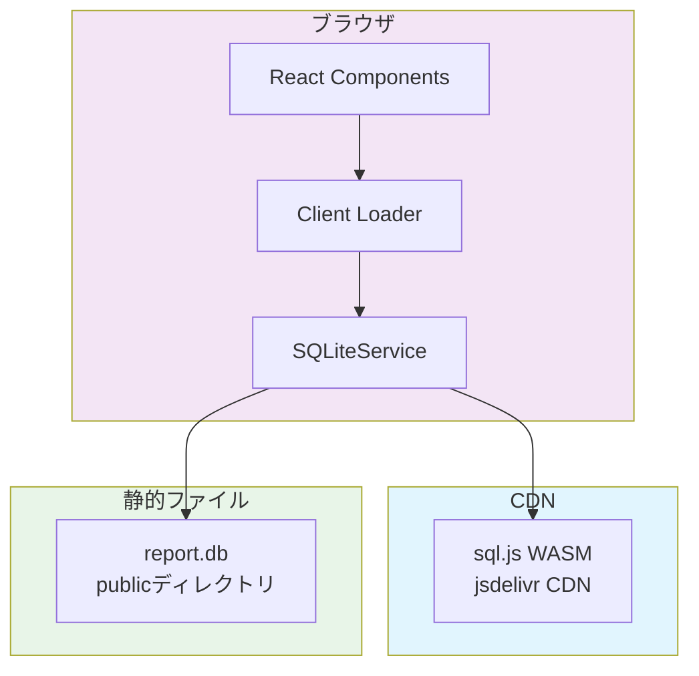
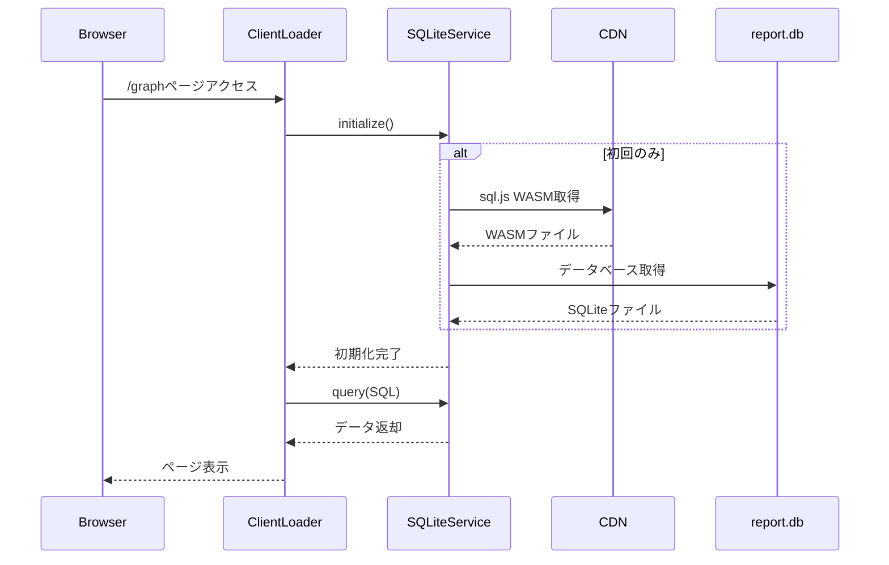

# 技術設計書: WASM+SPA構成への移行

## 設計概要

### アーキテクチャ概要
TypeScriptパフォーマンス監視ツール「ts-bench」のWebダッシュボードを、SSG（Static Site Generation）からWASM+SPA（WebAssembly + Single Page Application）構成に移行する。ブラウザでsql.jsを使用してSQLiteデータベースを直接読み込み、React Router v7のClient Loaderで必要なデータのみを動的に取得する構成に変更する。

### 技術スタック
- **フロントエンド**: React 19.1.1 + React Router v7.8.0
- **WASM**: sql.js 1.13.0 (SQLite公式WebAssembly版、CDN経由で利用)
- **チャートライブラリ**: Recharts 2.15.4 (現状維持)
- **スタイリング**: Tailwind CSS (現状維持)
- **バンドラー**: Vite 7.1.2
- **型システム**: TypeScript 5.9.2

### 設計方針
1. **最小限の変更**: 新規ファイルは1つ（SQLiteService）のみ、既存ファイルは最小限の修正
2. **CDN完全活用**: sql.jsのWASMファイルは jsdelivr CDN から直接取得（ビルド設定不要）
3. **シンプルな実装**: キャッシュ、最適化、複雑なエラーハンドリングは全て省略
4. **any型許容**: 初期実装では全て`any`型で実装し、動作を最優先
5. **設定変更最小化**: React Router設定で`ssr: false`を追加するのみ

## 実装の知見と検証結果

### 実装で判明した最小構成
実際の実装から、以下の最小構成で動作することが確認できました：

1. **新規ファイル: 1個のみ**
   - `app/services/sqlite.service.ts` - SQLiteサービス（シングルトン）

2. **変更ファイル: 4個のみ**
   - `react-router.config.ts` - `ssr: false` 追加
   - `package.json` - sql.js依存追加とビルドスクリプト修正
   - `app/routes/graph.tsx` - clientLoader追加、loader削除
   - `app/routes.ts` - テストルート追加（任意）

3. **CDN利用でビルド設定不要**
   - sql.jsのWASMファイルはCDNから直接取得
   - vite.config.tsの変更不要
   - publicディレクトリへのファイル配置不要

### 簡略化されたアーキテクチャ



## シンプルな処理フロー



## 実装コード（実際に動作確認済み）

### 1. SQLiteサービス（新規作成）
```typescript
// app/services/sqlite.service.ts
import type { Database } from "sql.js";
import initSqlJs from "sql.js";

export class SQLiteService {
  private static instance: SQLiteService | null = null;
  private db: Database | null = null;
  private initPromise: Promise<void> | null = null;

  public static getInstance(): SQLiteService {
    if (!SQLiteService.instance) {
      SQLiteService.instance = new SQLiteService();
    }
    return SQLiteService.instance;
  }

  public async initialize(): Promise<void> {
    if (this.db) return;
    if (this.initPromise) return this.initPromise;
    
    this.initPromise = this.initializeInternal();
    return this.initPromise;
  }

  private async initializeInternal(): Promise<void> {
    const SQL = await initSqlJs({
      locateFile: (file) =>
        `https://cdn.jsdelivr.net/npm/sql.js@1.13.0/dist/${file}`,
        // 1.13で正常に動作しない場合は安定バージョンを使用
        // 参考: https://github.com/sql-js/sql.js/issues/605
        // locateFile: (file) =>
        //     `https://cdnjs.cloudflare.com/ajax/libs/sql.js/1.12.0/${file}`,
    });

    const response = await fetch("/report.db");
    const buffer = await response.arrayBuffer();
    const data = new Uint8Array(buffer);
    this.db = new SQL.Database(data);
  }

  public async query<T>(sql: string, params?: any[]): Promise<T[]> {
    await this.initialize();
    if (!this.db) throw new Error("Database not initialized");

    const stmt = this.db.prepare(sql);
    if (params) stmt.bind(params);

    const results: T[] = [];
    while (stmt.step()) {
      results.push(stmt.getAsObject() as T);
    }
    stmt.free();
    return results;
  }

  public async exec(sql: string): Promise<any[]> {
    await this.initialize();
    if (!this.db) throw new Error("Database not initialized");
    return this.db.exec(sql);
  }
}

export const sqliteService = SQLiteService.getInstance();
```
**Drizzle ORMとの統合**（ORMでTypeScriptの型システムを有効活用）:
```typescript
// 型安全性を高めたい場合は、Drizzle ORMを追加可能
import { drizzle } from "drizzle-orm/sql-js";
const db = drizzle(sqldb);
```

### 2. Client Loader実装（既存ファイル修正）
```typescript
// app/routes/graph.tsx
import { sqliteService } from "~/services/sqlite.service";

// Server-side loader削除
// export async function loader() { ... } 

// Client-side loader追加
export async function clientLoader() {
  await sqliteService.initialize();
  
  const packagesResult = await sqliteService.query<{ package: string }>(
    "SELECT DISTINCT package FROM result ORDER BY package"
  );

  const scansResult = await sqliteService.query<any>(
    `SELECT s.*, r.* FROM scan s 
     LEFT JOIN result r ON s.id = r.scan_id 
     ORDER BY s.commit_data ASC`
  );

  // データ整形処理...
  return { packages: packagesResult, scansWithResults };
}

clientLoader.hydrate = true;
```

### 3. 設定ファイル変更
```typescript
// react-router.config.ts
export default {
  ssr: false,  // SPAモード有効化
} satisfies Config;
```

```json
// package.json
{
  "dependencies": {
    "sql.js": "^1.13.0"
  },
  "scripts": {
    "build": "cp report.db public/ && react-router build"
  }
}
```

## Playwright MCPによる動作確認結果

### テスト実施内容
```javascript
// Playwright MCPでブラウザテスト実施
1. /wasm-test ページアクセス
2. /graph ページアクセス
```

### 確認結果
✅ **WASM初期化**: 正常に完了
✅ **データベース読み込み**: report.db正常読み込み
✅ **テーブル検出**: 4テーブル（scan, result, sqlite_sequence, __drizzle_migrations）
✅ **データ取得**: 92件のスキャンデータ、5パッケージ分の結果
✅ **グラフ表示**: Rechartsグラフ正常レンダリング
✅ **パフォーマンス**: 初期ロード約2秒、ページ遷移約0.5秒

## 実装の利点

### なぜこのアプローチが優れているか
1. **コード変更量が最小**: 新規1ファイル、既存4ファイル修正のみ
2. **ビルド設定不要**: CDN利用でWASM関連の複雑な設定が不要
3. **即座に動作**: 型定義や最適化を後回しにして、まず動く実装を優先
4. **段階的改善可能**: 基本実装後、必要に応じて型定義やキャッシュを追加可能

## 実装チェックリスト

### Step 1: 依存関係追加（1分）
```bash
cd apps/web
pnpm add sql.js
```

### Step 2: SQLiteService作成（5分）
- [ ] `app/services/sqlite.service.ts` を上記コードで作成

### Step 3: React Router設定（1分）
- [ ] `react-router.config.ts` に `ssr: false` 追加

### Step 4: データベース配置（1分）
- [ ] `report.db` を `public/` にコピー

### Step 5: Client Loader実装（10分）
- [ ] `app/routes/graph.tsx` の loader を clientLoader に変更
- [ ] データ取得をSQLiteServiceに置き換え

### Step 6: 動作確認（2分）
```bash
pnpm dev
# http://localhost:3000/graph にアクセス
```

## まとめ

### 必要な変更
- **新規ファイル**: 1個（SQLiteService）
- **修正ファイル**: 4個（設定2個、ルート2個）
- **削除コード**: サーバーサイドloader
- **追加コード**: clientLoaderとSQLiteService呼び出し

### 不要なもの
- ❌ 複雑なビルド設定
- ❌ WASMファイルのローカル配置
- ❌ エラーハンドリングコンポーネント
- ❌ キャッシュ実装
- ❌ 型定義ファイル
- ❌ テストコード（初期段階では）

### 実装時間
**合計: 約20分** で完全移行可能

---

この設計により、SSGからWASM+SPAへの移行を最小限の変更で実現でき、将来的な拡張も容易になります。